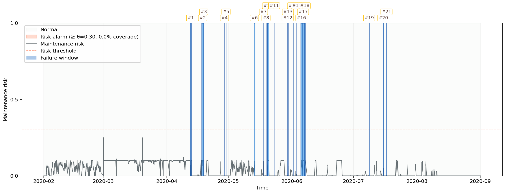
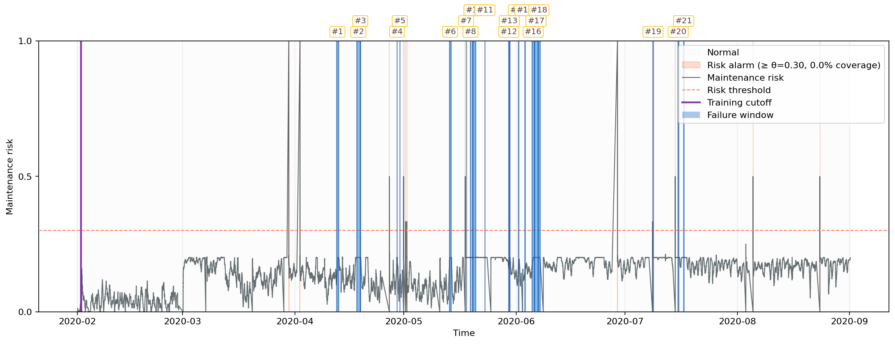

## MetroPT PdM Framework – Experimenti (opis workflowa)

Dokument opisuje trenutni workflow v repozitoriju metropt-pdm-framework in dve rezimi ucenja:
- **single** (en globalni model)
- **per_maint** (adaptivni model po servisih)

Opis je skladen s kodo in naj iz njega bralec razume, kako se podatki berejo, kako se modeli ucijo, kako se tvori risk signal in kako poteka evaluacija.

---

## 1) Branje in priprava podatkov

### Kakrsni so podatki
`datasets/MetroPT3.csv` vsebuje casovne vrste iz APU sistema tramvaja. Stolpci so:
- analogni senzorji (npr. tlaki, temperature, tokovi),
- binarni/kvazi-binarni signali (0/1),
- `timestamp` (casovni zig).

Program CSV prebere, `timestamp` uredi in nastavi kot indeks.

### Izbor znacilk
- vzamemo **vse numericne stolpce** (v MetroPT3 jih je 16),
- stolpce uredimo po domenski preferenci (`LIKELY_METROPT_FEATURES`), ce so prisotni.

Namen: ohraniti celoten nabor senzorjev brez dodatnega filtrov.

### Rolling znacilke
Na vseh numericnih signalih naredimo rolling statistike v oknu `ROLLING_WINDOW` (mean, std, min, max, skew ...). Rezultat je matrika `X`, ki jo dobijo modeli. Implementacija je v `data_utils.py`.

---

## 2) Maintenance okna in faze

Maintenance okna so vzeta **iz clanka Davari et al. (2021)**. Vsak timestamp dobi fazo:
- `operation_phase = 0` -> normalno stanje
- `operation_phase = 1` -> pre-maintenance (npr. 120 min pred servisom, `PRE_MAINTENANCE_MINUTES`)
- `operation_phase = 2` -> maintenance (servis)

Faze **niso vhod modela**, uporabljajo se samo za evaluacijo.

---

# Dve vrsti detekcije anomalij

## A) Point-wise anomalije (po vrstici)
Model vsaki vrstici dodeli `is_anomaly` (0/1):
- `is_anomaly = 1`, ce je `anom_score >= threshold`
- `threshold = Q3 + 3*IQR` iz **ucnih** score-ov (v `detector_model.py`)

### Point-wise evaluacija
V evaluacijo gredo samo faze 0 in 1:
- **TP**: phase=1 in is_anomaly=1
- **FP**: phase=0 in is_anomaly=1
- **FN**: phase=1 in is_anomaly=0
- **TN**: phase=0 in is_anomaly=0
- phase=2 je ignorirana

Iz point-wise evaluacije so dodatno izloceni:
- zacetni ucni interval (`TRAIN_FRAC` minut),
- vsi post-maintenance ucni intervali (fer primerjava med rezimi).

---

## B) Collective anomalije (event-level)
Event-level logika je zgrajena na **risk signalu**, ki meri gostoto ekstremnih tock v zadnjem casovnem oknu.

**Koraki:**
1) `risk_score` (normaliziran score)
   - vsak model oceni tocke in izracuna `risk_score` kot percentilni rang score-a glede na ucno porazdelitev
   - `risk_score` je v intervalu [0, 1]

2) `exceedance` ekstremov
   - `exceedance = 1`, ce `risk_score >= RISK_EXCEEDANCE_QUANTILE`
   - npr. 0.95 pomeni, da upostevamo le top 5% tock po tveganju

3) `maintenance_risk`
   - rolling povprecje `exceedance` v oknu `RISK_WINDOW_MINUTES`
   - to je delez ekstremnih tock v zadnjem oknu
   - **v per_maint rezimu se rolling izracuna z resetom na segmentih** (ne prelivamo med segmenti)

4) Alarm interval
   - vsak neprekinjen segment, kjer `maintenance_risk >= θ`

### Event-level TP/FP/FN
Za servis zacetek `start` in konec `end` velja okno:
`[start - PRE_MAINTENANCE_MINUTES, end]`

- **TP**: alarm interval se s tem oknom **prekriva** (overlap)
- **FN**: noben alarm se ne prekriva z oknom
- **FP**: alarm interval, ki ne pripada nobenemu servisu
- **TN** na event nivoju ni definiran (ni negativnih “eventov”)

---

# Rezim A: Single model (`EXPERIMENT_MODE="single"`) – `pipeline_runner.py`

## Ucenje
- model se uci na prvih `TRAIN_FRAC` minutah (trenutno 1440 min)
- `operation_phase == 2` je iz ucne mnozice izlocen

## Scoring
- model oceni vse vrstice v timeline-u
- izracuna `anom_score`, `is_anomaly` in `risk_score`

## Evaluacija
- point-wise in event-level logika kot zgoraj
- izlocimo tudi vse post-maintenance ucne intervale (fer primerjava s per_maint)

---

# Rezim B: Per-maintenance (`EXPERIMENT_MODE="per_maint"`) – `pipeline_runner.py`

## Globalni baseline
- baseline = zacetni `TRAIN_FRAC` interval (brez phase=2)
- vsak nov model se uci na **baseline + lokalni post-maint interval**
- to ni fine-tuning, vsak model se uci znova

## Segmenti in ucenje
Za vsak servis `Wj`:
- najprej se **oceni maintenance okno** z obstoječim modelom (risk only)
- definira se `gap = (end_j, start_{j+1})`
- ce je gap kratek (`<= POST_MAINT_TRAIN_MINUTES`):
  - nov model se ne uci, uporabi se prejsnji
- ce je gap daljsi:
  - prvih `POST_MAINT_TRAIN_MINUTES` po servisu je lokalni ucni interval
  - ucenje = baseline + lokalni interval (brez phase=2)
  - test = preostanek gap-a

## Scoring in risk
- vsak segment ima svoj model
- `risk_score` se racuna glede na **segmentno ucno porazdelitev**
- `maintenance_risk` se racuna **z resetom na segmentih**
- alarmi se oblikujejo iz celotnega risk signala

---

# Klucne razlike

| Lastnost | Single | Per-maintenance |
|---|---|---|
| Stevilo modelov | 1 | vec (po servisih + maintenance segmenti) |
| Ucni podatki | samo zacetni TRAIN_FRAC | baseline + lokalni post-maint |
| Risk normalizacija | globalna | segmentna |
| Risk rolling | enoten | resetiran na segmentih |
| Event-level logika | ista | ista |

---

# Rezultati (zadnji zagon)

### Event-level (Best θ)
| Rezim | Tag | θ | TP | FP | FN | Precision | Recall | F1 | Coverage |
|---|---|---:|---:|---:|---:|---:|---:|---:|---:|
| Single | `[RISK]` | 0.56 | 8 | 23 | 13 | 0.2581 | 0.3810 | 0.3077 | 5.3% |
| Per-maint | `[RISK-PERMAINT]` | 0.48 | 16 | 31 | 5 | 0.3404 | 0.7619 | 0.4706 | 4.4% |

### Point-wise
| Rezim | Tag | TP | FP | FN | TN | Precision | Recall | F1 | Accuracy |
|---|---|---:|---:|---:|---:|---:|---:|---:|---:|
| Single | `[METRIC] Single-model` | 2261 | 240374 | 6718 | 1111512 | 0.0093 | 0.2518 | 0.0180 | 0.8184 |
| Per-maint | `[METRIC] Per-maint-model` | 2456 | 201039 | 6523 | 1150846 | 0.0121 | 0.2735 | 0.0231 | 0.8475 |

**Interpretacija:**
- Per-maint ima visjo event-level F1 pri nizji pokritosti alarma (coverage).
- Single je bolj konservativen, a z nizjo recall vrednostjo.

---

# Vizualizacija (intuicija)

Single:
```
TRAIN_FRAC ----> [model A] ----------------------------------> scoring vseh vrstic
```

Per-maint:
```
baseline + post-maint_1 --> model B --> scoring gap_1
baseline + post-maint_2 --> model C --> scoring gap_2
...
```

Rezultat v obeh rezimih:
- `is_anomaly` za vsako vrstico (point-wise)
- `exceedance` = 1, ce `risk_score` preseze kvantil `RISK_EXCEEDANCE_QUANTILE`
- `maintenance_risk` za casovno okno (collective)
- `predicted_phase` = 1, ce `maintenance_risk >= θ` (alarmno stanje), sicer 0
- TP/FP/FN/TN (point-wise) in TP/FP/FN (event-level)

## Grafi (trenutni zagon)

### Per-maintenance


### Single

